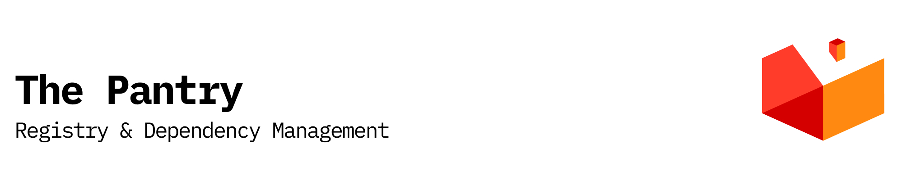

<p align="center"></p>

[![npm version][npm-version-src]][npm-version-href]
[![GitHub Actions][github-actions-src]][github-actions-href]
[](http://commitizen.github.io/cz-cli/)
<!-- [![npm downloads][npm-downloads-src]][npm-downloads-href] -->
<!-- [![Codecov][codecov-src]][codecov-href] -->

# launchpad

> A lightweight package manager built on top of pkgx to simplify package installation and management. _Similar to Homebrew, but faster._

## Features

Launchpad offers a streamlined approach to package management with these key features:

- 📦 **[Package Management](https://github.com/stacksjs/launchpad/tree/main/docs/features/package-management.md)** — Install and manage packages efficiently using pkgx
- 🔄 **[Executable Shims](https://github.com/stacksjs/launchpad/tree/main/docs/features/shim-creation.md)** — Create executable shims for packages automatically
- 🛠️ **[pkgx Management](https://github.com/stacksjs/launchpad/tree/main/docs/features/pkgx-management.md)** — Install and manage the pkgx utility itself
- 💻 **[Dev Environment](https://github.com/stacksjs/launchpad/tree/main/docs/features/dev-package.md)** — Dedicated command for the dev package for development environments
- 🚀 **[Bun Installation](https://github.com/stacksjs/launchpad/tree/main/docs/features/bun-installation.md)** — Install Bun directly from GitHub releases with platform detection
- 🔧 **Auto-updates** — Configure automatic updates for pkgx
- 🔌 **[PATH Integration](https://github.com/stacksjs/launchpad/tree/main/docs/features/path-management.md)** — Automatically add installation directories to your PATH
- 🪟 **Cross-platform** — Full support for macOS, Linux, and Windows systems

## Why Launchpad?

Traditional package managers like Homebrew have limitations:

- **Slow installations** — Installing or updating can take minutes
- **Dependency chains** — Updating one package triggers unwanted updates
- **Environment conflicts** — Different projects need different versions
- **PATH management** — Manual PATH configuration is error-prone
- **Platform inconsistency** — Different systems need different approaches

Launchpad solves these by providing:

- **Fast installations** — Leverage pkgx for efficient package management
- **Isolated packages** — Install only what you need without conflicts
- **Automatic PATH management** — Tools are available immediately
- **Consistent interface** — Same commands work everywhere
- **Dev environments** — Project-specific development environment support

[Read more about why we created Launchpad](https://github.com/stacksjs/launchpad/tree/main/docs/why.md)

## Installation

Launchpad is available through multiple package managers:

```bash
# Install with Bun (recommended)
bun add -g @stacksjs/launchpad

# Or with npm
npm install -g @stacksjs/launchpad

# Or with yarn
yarn global add @stacksjs/launchpad

# Or with pnpm
pnpm add -g @stacksjs/launchpad
```

See [Installation Guide](https://github.com/stacksjs/launchpad/tree/main/docs/install.md) for more options.

## Quick Start

### Install packages

```bash
# Install packages
launchpad install node python

# Use the shorthand
launchpad i node
```

### Create shims

```bash
# Create shims for executables
launchpad shim node typescript

# Specify custom path
launchpad shim --path ~/bin node
```

### Install pkgx

```bash
# Install pkgx itself
launchpad pkgx

# Force reinstall
launchpad pkgx --force
```

### Install dev package

```bash
# Install the dev package
launchpad dev

# With customization
launchpad dev --path ~/bin
```

### Install Bun

```bash
# Install Bun directly
launchpad bun

# Install specific version
launchpad bun --version 1.0.0
```

### Configure auto-updates

```bash
# Check current auto-update status
launchpad autoupdate

# Enable auto-updates
launchpad autoupdate:enable

# Disable auto-updates
launchpad autoupdate:disable
```

### List installed packages

```bash
# List all installed packages
launchpad list
# or
launchpad ls
```

## Configuration

Launchpad can be configured via a config file (`launchpad.config.ts`, `.launchpadrc`, etc.) or through command-line options.

Example configuration:

```ts
import type { LaunchpadConfig } from '@stacksjs/launchpad'

const config: LaunchpadConfig = {
  // Enable verbose logging
  verbose: true,

  // Installation path for binaries
  installationPath: '/usr/local',

  // Auto-elevate with sudo when needed
  autoSudo: true,

  // Retry settings
  maxRetries: 3,
  timeout: 60000,

  // Version handling
  symlinkVersions: true,
  forceReinstall: false,

  // PATH management
  shimPath: '~/.local/bin',
  autoAddToPath: true,
}

export default config
```

See [Configuration Guide](https://github.com/stacksjs/launchpad/tree/main/docs/config.md) for all options.

## GitHub Action

Launchpad provides a GitHub Action for CI/CD workflows:

```yaml
- name: Install Dependencies
  uses: stacksjs/launchpad-installer@v1
  with:
    packages: node typescript bun
```

See [GitHub Action Documentation](https://github.com/stacksjs/launchpad/tree/main/packages/action/README.md) for details.

## Advanced Usage

Explore advanced topics in our documentation:

- [Custom Shims](https://github.com/stacksjs/launchpad/tree/main/docs/advanced/custom-shims.md)
- [Cross-platform Compatibility](https://github.com/stacksjs/launchpad/tree/main/docs/advanced/cross-platform.md)
- [Performance Optimization](https://github.com/stacksjs/launchpad/tree/main/docs/advanced/performance.md)
- [API Reference](https://github.com/stacksjs/launchpad/tree/main/docs/api/reference.md)

## Comparing to Alternatives

### vs Homebrew

- **Speed**: Significantly faster installations
- **Isolation**: Changes to one package don't affect others
- **Less disk space**: Only install what you need

### vs Manual Installation

- **Simplicity**: Single command to install complex tools
- **PATH management**: No need to manually edit shell config files
- **Version control**: Easily install specific versions
- **Consistency**: Same experience across all platforms

## Changelog

Please see our [releases](https://github.com/stackjs/launchpad/releases) page for information on changes.

## Contributing

Please see [CONTRIBUTING](.github/CONTRIBUTING.md) for details.

## Community

For help or discussion:

- [Discussions on GitHub](https://github.com/stacksjs/launchpad/discussions)
- [Join the Stacks Discord Server](https://discord.gg/stacksjs)

## Postcardware

Two things are true: Stacks OSS will always stay open-source, and we do love to receive postcards from wherever Stacks is used! 🌍 _We also publish them on our website. And thank you, Spatie_

Our address: Stacks.js, 12665 Village Ln #2306, Playa Vista, CA 90094, United States 🌎

## Credits

- [Max Howell](https://github.com/mxcl) - for creating [pkgx](https://github.com/pkgxdev/pkgx) and [Homebrew](https://github.com/Homebrew/brew)
- [pkgm](https://github.com/pkgxdev/pkgm) - for the initial inspiration
- [Chris Breuer](https://github.com/chrisbbreuer)
- [All Contributors](https://github.com/stacksjs/launchpad/graphs/contributors)

## Sponsors

We would like to extend our thanks to the following sponsors for funding Stacks development. If you are interested in becoming a sponsor, please reach out to us.

- [JetBrains](https://www.jetbrains.com/)
- [The Solana Foundation](https://solana.com/)

## License

The MIT License (MIT). Please see [LICENSE](LICENSE.md) for more information.

Made with 💙

<!-- Badges -->
[npm-version-src]: https://img.shields.io/npm/v/@stacksjs/launchpad?style=flat-square
[npm-version-href]: https://npmjs.com/package/@stacksjs/launchpad
[github-actions-src]: https://img.shields.io/github/actions/workflow/status/stacksjs/launchpad/ci.yml?style=flat-square&branch=main
[github-actions-href]: https://github.com/stacksjs/launchpad/actions?query=workflow%3Aci

<!-- [codecov-src]: https://img.shields.io/codecov/c/gh/stacksjs/launchpad/main?style=flat-square
[codecov-href]: https://codecov.io/gh/stacksjs/launchpad -->
